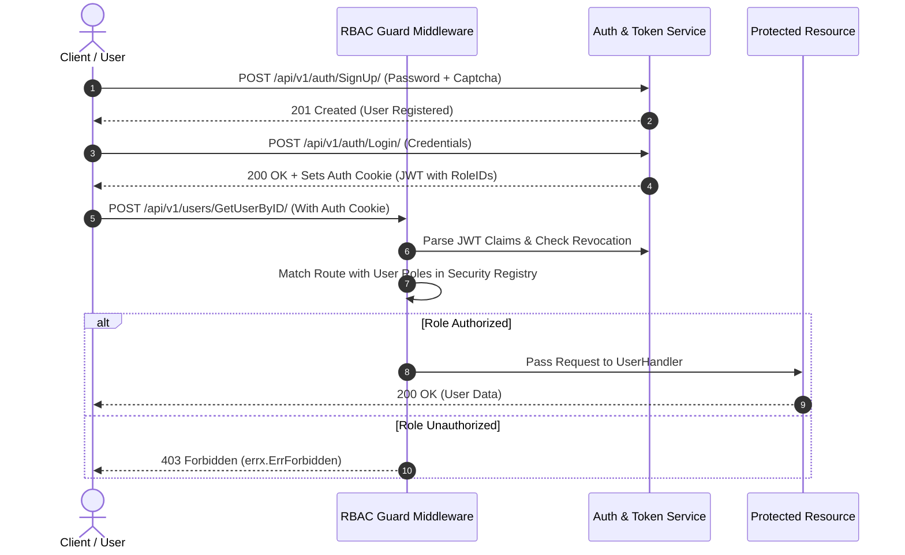

# Ticket API — Enterprise Test Suite & Architecture Guide

This document acts as the **single source of truth** for all automated tests in the `TicketApi` project. It details the testing hierarchy, End-to-End (E2E) user journey scenarios, integration tests, and unit/edge-case tests across all architectural layers.

---

## 1. End-to-End & Scenario Tests

E2E Scenario tests simulate realistic client, user, and agent workflows across the entire system.

### Scenario 1: New Ticket Creation & Resolution Lifecycle

The following diagram illustrates the complete end-to-end lifecycle of a ticket created by a guest/user, managed by an agent, and closed upon resolution:

```mermaid
flowchart TD
    classDef client fill:#e1f5fe,stroke:#0288d1,stroke-width:2px,color:#01579b;
    classDef server fill:#e8f5e9,stroke:#388e3c,stroke-width:2px,color:#1b5e20;
    classDef agent fill:#fff3e0,stroke:#f57c00,stroke-width:2px,color:#e65100;
    classDef db fill:#ede7f6,stroke:#512da8,stroke-width:2px,color:#311b92;

    subgraph Phase1["1. Captcha & Metadata Discovery"]
        Client([User / Guest Client]):::client -->|1. GET /api/v1/captcha/GetCaptcha/| Server[Ticket API Engine]:::server
        Server -->|Returns CaptchaID & Image| Client
        Client -->|2. POST /api/v1/captcha/VerifyCaptcha/| Server
        Server -->|Sets Captcha Cookie / JWT Token| Client
        Client -->|3. GET /api/v1/departments/GetAllActiveDepartments/| Server
        Client -->|4. GET /api/v1/tickets/GetAllActiveTicketTypes/| Server
        Server -->|Returns Departments & Active Types| Client
    end

    subgraph Phase2["2. Ticket Creation & Tracking"]
        Client -->|5. POST /api/v1/tickets/CreateTicket/ <br/> Payload: Title, Body, Phone, DeptID, TypeID| Server
        Server -->|6. Validate Limits & Generate Unique TrackCode| TicketStore[(Ticket Storage)]:::db
        TicketStore -->|Persists Ticket & First Message| Server
        Server -->|Returns TicketID & TrackCode| Client
        Client -->|7. POST /api/v1/tickets/GetTicketByTrackCode/| Server
        Server -->|Returns Ticket details & Chat history| Client
    end

    subgraph Phase3["3. Communication & Agent Resolution"]
        Client -->|8. POST /api/v1/tickets/:id/CreateChat/| Server
        Server -->|Appends User message| TicketStore
        Agent([Support Agent]):::agent -->|9. POST /api/v1/auth/Login/| Server
        Server -->|Issues Auth Cookie & RBAC Claims| Agent
        Agent -->|10. POST /api/v1/tickets/GetTicketByID/| Server
        Server -->|Validates RBAC & returns Ticket| Agent
        Agent -->|11. POST /api/v1/tickets/:id/CreateChat/ <br/> senderType: 'agent'| Server
        Server -->|Appends Agent response to thread| TicketStore
        Agent -->|12. POST /api/v1/tickets/CloseTicket/| Server
        Server -->|Updates status to 'closed'| TicketStore
        Server -->|Returns updated Closed Ticket| Agent
    end
```



### Scenario 2: Authentication & Role-Based Access Control (RBAC)



---

## 2. Test Suite Categorization & Coverage

| Category | Test File | Target Layer | Key Aspects Covered |
| :--- | :--- | :--- | :--- |
| **Scenario / E2E** | `test/scenario/ticket_flow_test.go` | Full System Flow | Complete ticket creation, track code verification, chat message appending, agent response, and ticket closure. |
| **Integration / RBAC** | `internal/middleware/rbac_middleware_test.go` | Middleware | Dynamic RBAC matching against registered routes and user roles. |
| **Integration / Security** | `internal/security/registry_test.go` | Security Layer | Security registry caching and route-role mappings. |
| **Integration / Repos** | `internal/repository/repositories_test.go` | Repository (SQL) | SQLite database queries, transactional integrity, foreign keys, and cache invalidation across users, departments, ticket types, statuses, and priorities. |
| **Unit / Handlers** | `internal/handler/auth_handler_test.go` | Handler | `SignUpWithPassword`, `LoginWithPassword`, `LoginWithNoAuth`, cookie setting, and captcha gating. |
| **Unit / Handlers** | `internal/handler/user_handlers_test.go` | Handler | `GetUserByID`, `GetUserByUsername`, `GetUsersByIDs`, parameter binding, and auth protection. |
| **Unit / Handlers** | `internal/handler/department_handler_test.go` | Handler | `GetAllActiveDepartments` response and DTO formatting. |
| **Unit / Handlers** | `internal/handler/captcha_handler_test.go` | Handler | `GetCaptcha` generation and format. |
| **Unit / Handlers** | `internal/handler/ticket_handler_test.go` | Handler | Public endpoints for active ticket types and statuses. |
| **Unit / Services** | `internal/services/ticket/ticket_service_test.go` | Service | Ticket attachment limits, track code parsing, type/department existence validations. |
| **Unit / Services** | `internal/services/auth/auth_service_test.go` | Service | Password hashing, verification, cookie issuance, and NoAuth auto-registration. |
| **Unit / Services** | `internal/services/user/user_service_test.go` | Service | User lookups by ID/username/list with error propagation. |
| **Unit / Services** | `internal/services/captcha/captcha_service_test.go` | Service | Captcha image generation, answer caching, verification, and token lifecycle. |
| **Unit / Services** | `internal/services/token/auth_token_test.go` | Service | JWT creation, claims validation, revocation checks, and secret key parsing. |

---

## 3. How to Run the Tests

### 1. Run all tests
```bash
go test -v ./...
```

### 2. Run with code coverage report
```bash
go test -coverprofile=coverage.out ./...
go tool cover -func=coverage.out
```

### 3. Run specific test scenario
```bash
go test -v ./test/scenario -run TestScenario_CompleteTicketLifecycle
```
